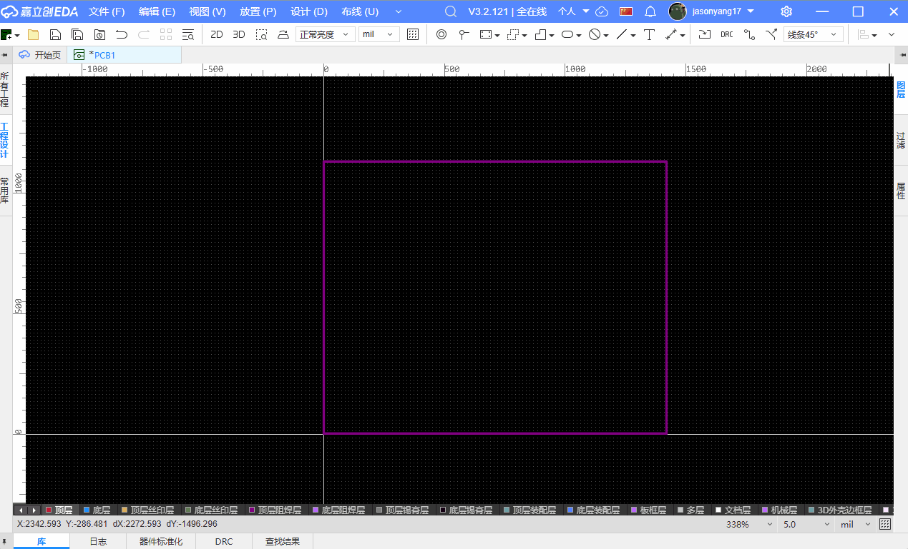
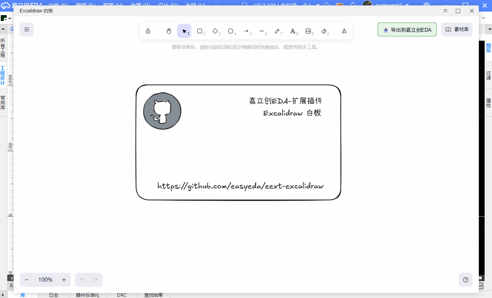
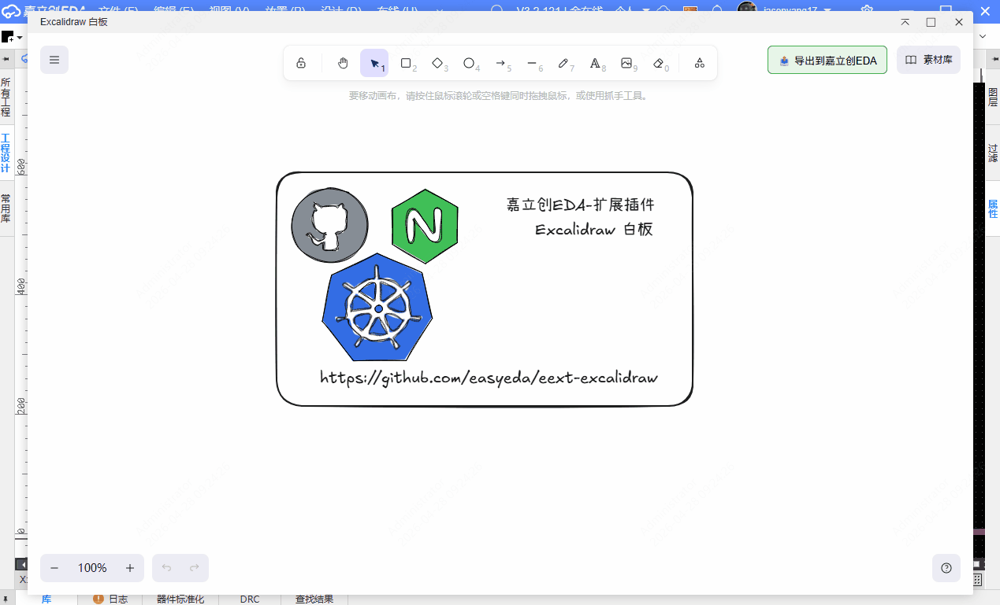

[简体中文](#) | [English](./README.en.md)

# Excalidraw

基于[Excalidraw](https://excalidraw.com/)修改，与[嘉立创EDA-API](https://prodocs.lceda.cn/cn/api/reference/pro-api.html)融合。  
现在你可以在[嘉立创EDA专业版](https://pro.lceda.cn/)中使用 [Excalidraw](https://excalidraw.com/) 手绘风格白板。

## 功能

✅ 自由手绘板载，集成 EDA 绘图环境，让电路板成为你的画布  

✅ 集成 Mermaid 框架，流程图、时序图、类图一键生成，逻辑结构跃然板上  

✅ 智能二值化处理，手绘图稿秒转丝印/沉金工艺，打造极具个人辨识度的 PCB  

✅ 支持彩色原图一键转换，适配彩色丝印工艺，让你的自制 Logo 与彩印 PCB 脱颖而出  

## 参考

- 致谢 [excalidraw组织](https://github.com/excalidraw/excalidraw) 与 [社区贡献者](contributors)

